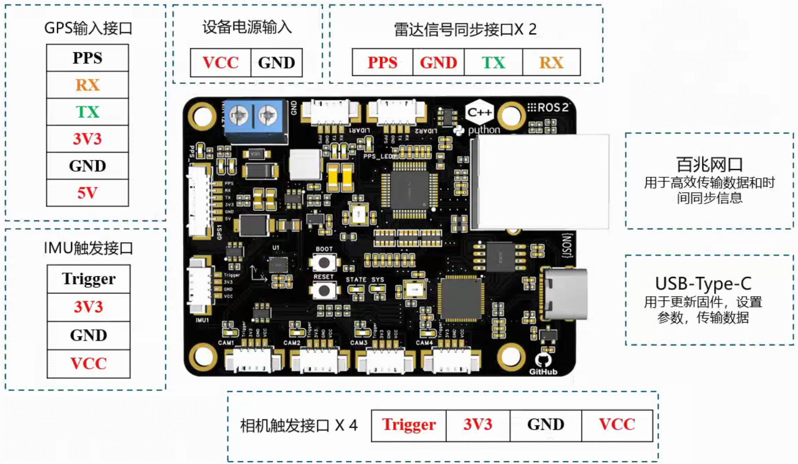
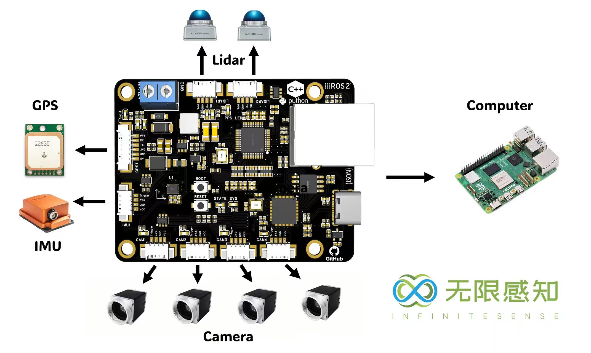

 
<em>稳定 易用 精度</em>
 

<a href="README_EN.md">English</a>

---

# 🚀 [一个简单易用的多传感器同步方案](https://github.com/InfiniteSenseLab/SimpleSensorSync/wiki)！

✨ 精简依赖 – 降低编译开销，构建更快速。  
🤖 支持 ROS2 & Python – 轻松集成现代机器人与脚本化工作流。  
⏱ 更精准的同步机制 – 提供更高精度的时间协调。  
📡 数据协议更透明(JSON) – 通信更清晰、更灵活。  
⚙️ 配置更简单 – 轻松上手，自定义更便捷[快速使用说明与系统说明](https://github.com/InfiniteSenseLab/SimpleSensorSync/wiki)。  
📜 日志功能增强 – 记录更全面，调试更高效。   
🌐 多平台灵活部署 – (ZeroMQ)支持嵌入式/桌面/云端多场景部署。  
🔗 支持多相机 📷、雷达⦿ 、IMU 🧭 与单 GPS 🛰 的混合信号协同管理。  
🔄 [支持多同步板](assets/doc/board_introduction.md) -V3/V4/MINI。  
🛡️ 安全可靠 – 更加安全的电源与接线🚫。

# News

>1. 完整的[使用说明与系统说明](https://github.com/InfiniteSenseLab/SimpleSensorSync/wiki)发布。
>2. 正在更新Demo使用案例与更加准确的同步验证教程。
>3. 正在开发基于Python的使用Demo。
>4. V3/V4/MINI同步板同步支持。

  
  &nbsp;&nbsp;&nbsp;
  

# 支持设备

>| 设备类型        | 品牌                            |同步方式 |
>|-------------|-------------------------------|--------|
>| 工业相机(网口)    | 海康/大华/大恒/京航/...               | PWM    |
>| 工业相机(USB)   | 海康/大华/大恒/京航/...               | PWM    |
>| 第三方IMU      | Xsense全系列/...                 | PWM    |
>| 3D激光        | Mid360/Mid70/RoboSense系列/...  | PPS   |
>| RTK/GPS     | 所有支持NMEA0183设备                | NMEA   |
>| 主机(ARM/X86) | Intel/AMD/Jetson/RockChip/... | PTP    |

# 咨询购买

[【淘宝】Access denied MF3543 「多相机IMU同步板网口串口同步工业相机六轴姿态」
点击链接直接打开 或者 淘宝搜索直接打开](https://item.taobao.com/item.htm?ft=t&id=832624497202)

