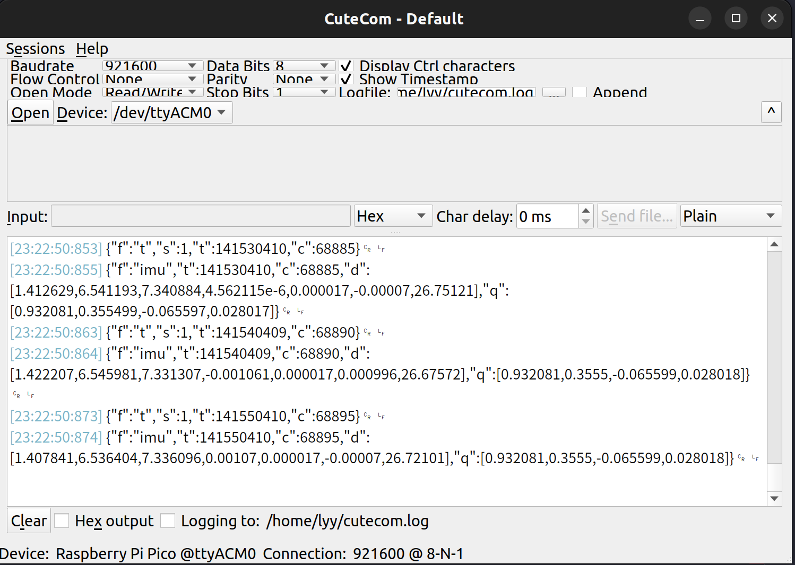
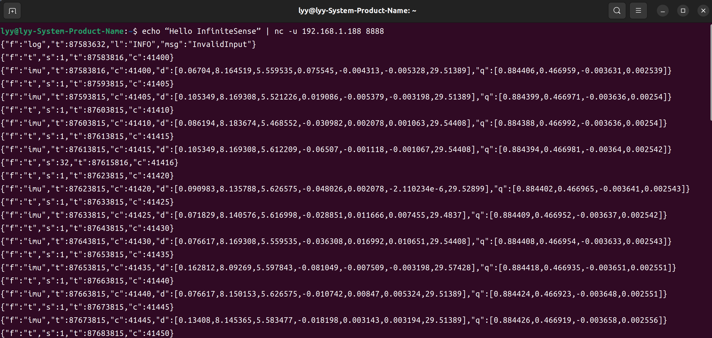

# 如何查看同步板上传数据
如果是USB连接:则需要安装串口工具，如：cutecom。
```bash
sudo apt-get install cutecom # 下载(可选)
sudo cutecom                 # 启动
```
<p align="center">

</p>

如果是网口连接： 则使用nc指令，Linux中nc命令是一个功能强大的网络工具，全称是netcat

```bash
# 192.168.1.188 8888 表示同步板的IP地址和端口
echo “Hello InfiniteSense” | nc -u 192.168.1.188 8888
```
<p align="center">

</p>

---
# IMU Data
```json
{
  "f": "imu",            # 数据类型
  "t": 1745767254869878, # 时间戳
  "c": 920480,           # 采集帧数
  "d": [                 # IMU原始数据
    0.416606,            # 加速度计x轴
    -0.181966,           # 加速度计y轴
    9.993754,            # 加速度计z轴
    0.003141,            # 陀螺仪x轴
    0.001038,            # 陀螺仪y轴
    0.000016,            # 陀螺仪z轴
    28.50241             # 温度
  ],
  "q": [                 # 同步板自带IMU计算的姿态
    0.999765,            # 四元数w
    -0.009251,           # 四元数x
    -0.021048,           # 四元数y
    -0.013569            # 四元数z
  ]
}
```
# GPS Data
```json
{
  "f": "GNGGA",          # 数据类型
  "g": false,            # 是否是PPS触发采集
  "t": 21664068,         # 串口接收到GPS数据的同步系统时间戳
  "d": "$GNGGA,123519,4807.038,N,01131.000,E,1,08,0.9,545.4,M,46.9,M,,*47\r",
  "pps": 21664010        # PPS触发对应的同步系统时间戳
}
```

```json
$GNGGA,123519,4807.038,N,01131.000,E,1,08,0.9,545.4,M,46.9,M,,*47
    时间 (123519): UTC 时间 12:35:19
    纬度 (4807.038,N): 纬度 48°07.038’ N（即 48 度 7.038 分 北纬）
    经度 (01131.000,E): 经度 11°31.000’ E（即 11 度 31.000 分 东经）
    定位状态 (1): 表示 GPS 定位有效
    卫星数 (08): 使用了 8颗卫星进行定位
    HDOP (0.9): 水平精度因子为 0.9，精度较好
    高度 (545.4): 高程 545.4 米
    单位 (M): 高度单位是米
    海平面分离 (46.9,M): 与海平面的分离为 46.9 米
    差分修正数据的年龄: 无差分修正数据，因此为空
    校验和 (*47): 校验和为 47
```
# Device trigger status
```json
{
  "f": "t",                     # 数据类型
  "s": 32,                      # (uint8_t)状态位
  "t": 1745767200873878,        # 时间戳
  "c": 893482                   # 采集帧数
} 
```
