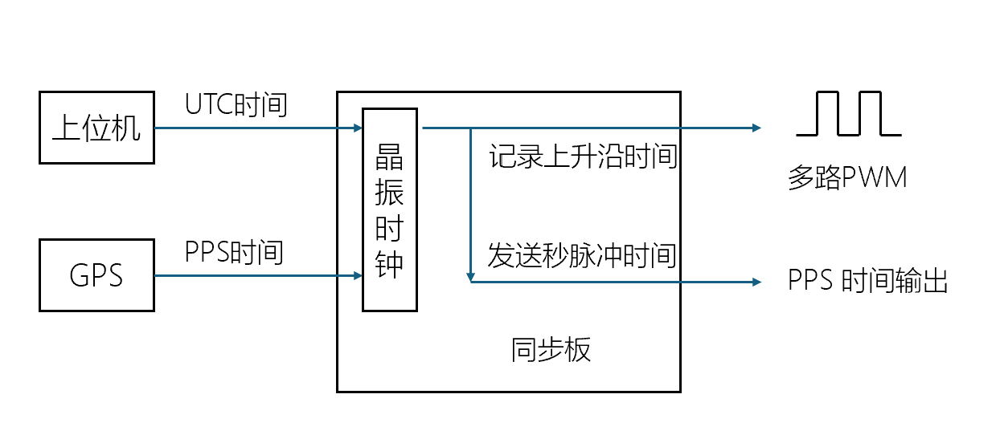
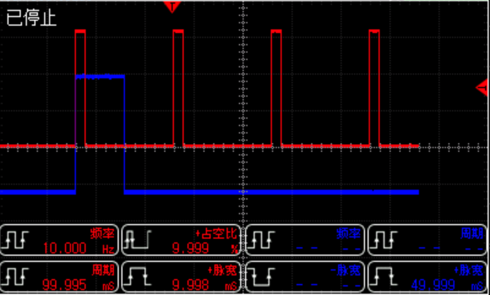
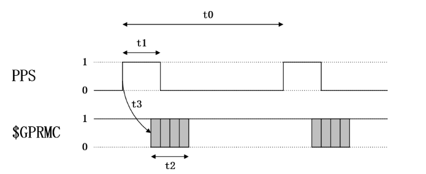
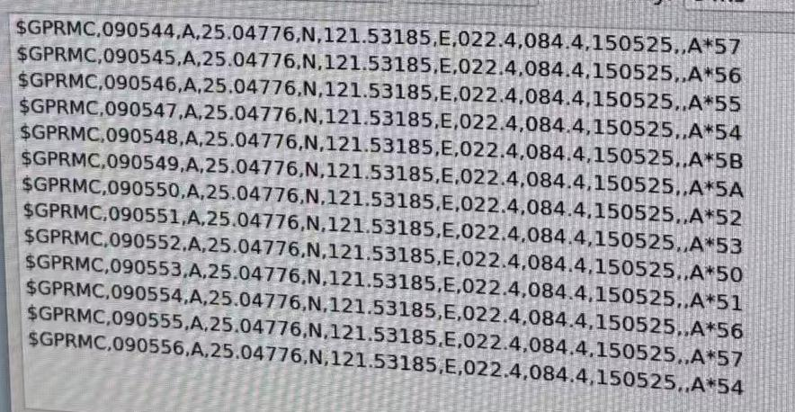

# 同步板软件介绍

本固件系统采用模块化设计，兼顾时间同步精度、低延迟控制与易用性，为多传感器融合系统提供稳定、灵活的软件支撑。整体的功能如下图所示



其中，时间戳的输入来自于上位机或者GPS，然后在本地系统板中进行计时。然后根据不同的需要将系统时间转换为PWM上升沿、PPS时间戳等格式，用于给不同传感器授时。本质上同步板是一个支持不同设备、不同格式的时间分发装置。


## 时间管理功能

同步板内部的系统时间来自于稳定的上位机发送的UTC（协调世界时）时间。为了获取更高的时间同步精度，一个类似PTP的软件同步机制被用于上位机和同步板进行时间戳对齐。

$$
t_{pc} == t_{sys}
$$

另一个时间源来自于GPS，它是不稳定的（室内）并且并不是所有场景下都搭载了GPS设备。因此，GPS的时间戳数据只会被采集并不会被用于整体系统时间，而是实时估计GPS和系统之间的时间差。用户可以自行选择采用所提供的系统时间还是GPS时间，他们的转换关系如下

$$
t_{sys} = t_{gps} + \Delta t
$$


## 同源PWM生成

同源PWM是指具有不同频率但是相同相位的PWM信号，它能够保证外部传感器的触发时间成倍数关系。



例如，相机以10Hz采集，而外部IMU以100Hz采集，同源PWM则可以保证相机采集的时刻刚好对应一帧IMU数据。

同步板将采集PWM的上升沿时刻，并记录反馈给上位机，这样上位机即可精准的获得每一个触发时刻的时间。

## PPS+GPRMC时间戳输出功能

支持标准的PPS+GPRMC时间戳输出功能


PPS信号和GPRMC信号的时序输出
| 参数 | 描述                              | 有效范围         | 使用值            |
|------|-----------------------------------|------------------|-------------------|
| t0   | 相邻两次秒脉冲上升沿的间隔        | 900 ms ~ 1100 ms | 1000 ms           |
| t1   | 秒脉冲的高电平时间                | 5 ms ~ 900 ms    | 10 ms ~ 200 ms    |
| t2   | GPRMC的传输时间（波特率：9600bps）| ≈ 70 ms          | 70 ms             |
| t3   | GPRMC数据开始发送相对于脉冲上升沿的延迟 | 0 ms ~ 900 ms    | 0 ms ~ 430 ms     |

典型的GPRMC数据格式输出为



## 通信协议

和上位机通信采用JSON格式进行，主要分为两种主要的信息格式，即配置消息格式和数据反馈信息格式。

### 配置JSON格式


```json lines
{"f":"cfg","port":8888,"ip":[192,168,1,188],"subnet":[255,255,255,0],"hz_cam_1":1,"hz_cam_2":2,"hz_cam_3":4,"hz_cam_4":8,"hz_imu_2":10,"xtal_diff":0,"uart_0_baud_rate":921600,"uart_1_baud_rate":9600,"uart_2_baud_rate":115200,"use_gps":true,"use_pps":true,"version":400}\n
```
对应指令说明：
```json
  "f": "cfg",                 // 配置文件类型标识符（固定为"cfg"）
  "port": 8888,               // 网络通信端口号
  "ip": [192,168,1,188],      // 设备IP地址
  "subnet": [255,255,255,0],  // 子网掩码配置
  "hz_cam_1": 20,             // 相机1触发频率（单位：Hz，建议≤100Hz）
  "hz_cam_2": 30,             // 相机2触发频率（单位：Hz，建议≤100Hz）
  "hz_cam_3": 40,             // 相机3触发频率（单位：Hz，建议≤100Hz）
  "hz_cam_4": 50,             // 相机4触发频率（单位：Hz，建议≤100Hz）
  "hz_imu_2":1                // IMU2触发频率（单位：Hz，建议≤100Hz）
  "uart_0_baud_rate": 921600, // 通讯波特率(Typc)（高速模式，用于时间同步/传感器数据）
  "uart_1_baud_rate": 9600,   // PPS波特率(Lidar)（低速模式，用于雷达同步）
  "uart_2_baud_rate": 115200, // GPS波特率(GPS/RTK)（中速模式，用于GPS数据读取）
  "use_gps": true,            // GPS模块启用标志
  "use_pps": true,            // PPS精确时钟同步信号启用标志
  "xtal_diff":0,              // 晶振偏差修正
  "version": 400              // 固件版本号(V3/MINI：300，V4：400)
```
配置完成后串口助手打印如下信息：
```json
{"f":"log","t":11320243,"l":"INFO","msg":"Config file received!"}
{"f":"log","t":11321532,"l":"INFO","msg":"Config set ok"}
{"f":"cfg","port":8888,"ip":[192,168,1,188],"subnet":[255,255,255,0],"hz_cam_1":1,"hz_cam_2":2,"hz_cam_3":4,"hz_cam_4":8,"hz_imu_2":10,"xtal_diff":0,"uart_0_baud_rate":921600,"uart_1_baud_rate":9600,"uart_2_baud_rate":115200,"use_gps":true,"use_pps":true,"version":400}
{"f":"log","t":11325745,"l":"INFO","msg":"Port parsed: 8888"}
{"f":"log","t":11326439,"l":"INFO","msg":"IP array set: 192.168.1.188"}
{"f":"log","t":11327234,"l":"INFO","msg":"Subnet array set: 255.255.255.0"}
{"f":"log","t":11328054,"l":"INFO","msg":"Device frequencies parsed: [1, 2, 4, 8, 10]"}
{"f":"log","t":11329034,"l":"INFO","msg":"UART baud rates parsed: [921600, 9600, 115200]"}
{"f":"log","t":11329939,"l":"INFO","msg":"GPS and PPS flags parsed: use_gps:1, use_pps:1"}
{"f":"log","t":11330800,"l":"INFO","msg":"Xtal diff set: 0"}
{"f":"log","t":11331380,"l":"INFO","msg":"Version set: 400"}
{"f":"log","t":11331935,"l":"INFO","msg":"Version parsed: 400"}
{"f":"log","t":1003932,"l":"INFO","msg":"[USB-TYPC] Configuration complete! baudrate:921600"}
{"f":"cfg","port":8888,"ip":[192,168,1,188],"subnet":[255,255,255,0],"hz_cam_1":1,"hz_cam_2":2,"hz_cam_3":4,"hz_cam_4":8,"hz_imu_2":10,"xtal_diff":0,"uart_0_baud_rate":921600,"uart_1_baud_rate":9600,"uart_2_baud_rate":115200,"use_gps":true,"use_pps":true,"version":400}
```


### 数据JSON格式

#### 1. IMU Data
```json
{
  "f": "imu",            # 数据类型
  "t": 1745767254869878, # 时间戳
  "c": 920480,           # 采集帧数
  "d": [                 # IMU原始数据
    0.416606,            # 加速度计x轴
    -0.181966,           # 加速度计y轴
    9.993754,            # 加速度计z轴
    0.003141,            # 陀螺仪x轴
    0.001038,            # 陀螺仪y轴
    0.000016,            # 陀螺仪z轴
    28.50241             # 温度
  ],
  "q": [                 # 同步板自带IMU计算的姿态
    0.999765,            # 四元数w
    -0.009251,           # 四元数x
    -0.021048,           # 四元数y
    -0.013569            # 四元数z
  ]
}
```

#### 2. GPS Data
```json
{
  "f": "GNGGA",          # 数据类型
  "g": false,            # 是否是PPS触发采集
  "t": 21664068,         # 串口接收到GPS数据的同步系统时间戳
  "d": "$GNGGA,123519,4807.038,N,01131.000,E,1,08,0.9,545.4,M,46.9,M,,*47\r",
  "pps": 21664010        # PPS触发对应的同步系统时间戳
}
```


GPS 接收数据解释：
```json
$GNGGA,123519,4807.038,N,01131.000,E,1,08,0.9,545.4,M,46.9,M,,*47
    时间 (123519): UTC 时间 12:35:19
    纬度 (4807.038,N): 纬度 48°07.038’ N（即 48 度 7.038 分 北纬）
    经度 (01131.000,E): 经度 11°31.000’ E（即 11 度 31.000 分 东经）
    定位状态 (1): 表示 GPS 定位有效
    卫星数 (08): 使用了 8颗卫星进行定位
    HDOP (0.9): 水平精度因子为 0.9，精度较好
    高度 (545.4): 高程 545.4 米
    单位 (M): 高度单位是米
    海平面分离 (46.9,M): 与海平面的分离为 46.9 米
    差分修正数据的年龄: 无差分修正数据，因此为空
    校验和 (*47): 校验和为 47
```


#### 3. PWM设备上升沿触发时间

```json
{
  "f": "t",                     # 数据类型
  "s": 32,                      # (uint8_t)状态位
  "t": 1745767200873878,        # 时间戳
  "c": 893482                   # 采集帧数
} 
```


## 固件烧写流程

1. 按住BOOT按钮，不要松开，将TYPC插入到电脑上电后，松开BOOT按钮，电脑会自动识别并识别为USB存储设备。
2. 将最新的固件移动到U盘中。
3. 移动完成后系统会自动删除U盘。这时候最新的固件已经被成功加载了。


## 固件更新日志


