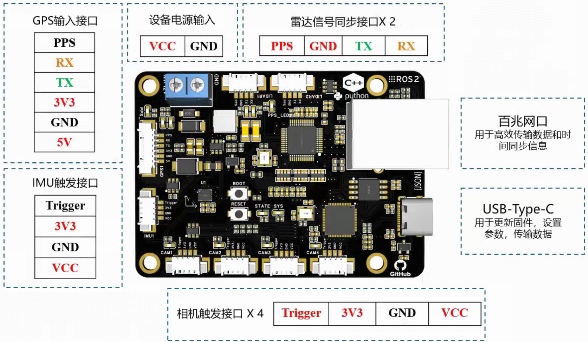

# 同步板硬件介绍

无限感知开发的时间同步板是一款高精度、低延迟的时间同步硬件模块，专为多传感器系统（如相机、IMU、激光雷达、雷达等）设计，适用于自动驾驶、机器人感知、测绘系统、工业自动化等场景。该同步板通过集中控制与时间对齐机制，确保不同类型传感器间的数据具有统一的时间戳，大幅提升数据融合精度和系统一致性。

## 二、主要特性

1. 五路可配置频率的同源PWM触发信号
2. 两路PPS输出雷达/外部IMU同步信号
3. 一路PPS输入GPS同步信号
4. 12V电源输入，可用于工业相机供电
5. 可选网口/串口用于上位机通信
6. 内置 ICM-42688P 陀螺仪芯片

## 三、硬件规格

### 主控规格

- 双核Arm Cortex-M0+架构，主频高达133MHz
- 配备264KB SRAM、丰富的DMA支持、时钟管理灵活，适合精密控制与高速数据处理
- 拥有多个独立I/O通道，可灵活配置GPIO、中断与外设通信，极大增强传感器接口兼容性

### IMU 芯片 (ICM-42688P)

同步板搭载MEMS的陀螺仪，能够满足绝大多数视觉SLAM系统的使用，能够有效补充视觉或雷达信息的退化情况。ICM42688是TDK InvenSense推出的一款高性能6轴MEMS运动传感器，集成了3轴加速度计和3轴陀螺仪，适用于AR/VR、无人机、智能手机、可穿戴设备等应用。

**​官方数据手册**：[ICM-42688-P 数据手册](https://item.szlcsc.com/datasheet/ICM-42688-P/1941231.html?spm=sc.gb.xds.a&lcsc_vid=T1BWUFxVE1RYVlYDFVgIBFBfEVQKVlEERFFdVlNWRVgxVlNSRVRaVFdRRldZVTsOAxUeFF5JWBYZEEoVDQ0NFAdIFA4DSA%3D%3D)

### 网口芯片

为了提高板载系统和上位机之间的时间同步精度，高效稳定的通信是必不可少的。因此，我们采用W5500芯片构建了100/10M的高速网口通信。W5500 是一款全硬件 TCP/IP 嵌入式以太网控制器，为嵌入式系统提供了更加简易的互联网连接方 案。W5500 集成了 TCP/IP 协议栈，10/100M 以太网数据链路层（MAC） 及物理层（PHY），使得 用户使用单芯片就能够在他们的应用中拓展网络连接。

**​官方数据手册**：[W5500 数据手册](https://atta.szlcsc.com/upload/public/pdf/source/20230714/E10C32B058E0BA54FCE1C1556BE10C07.pdf)

### 电源规格

为了给一些传感器供电，本产品集成了简单的电源转换功能，但是只适用于功率较小的器件，方便接线。

- 供电电压 12V
- 内部功率 < 1 W
- 外部传感器供电 5V @ 0.2A 
- 外部传感器供电 3.3V @ 0.1 A
- 外部传感器供电 12V @ 1A

## 四、接口说明

### PWM输出接口

PWM信号可以用于相机、外部IMu等设备的触发，凡是支持上升沿触发的设备都可以采用所提出的PWM接口进行同步。5路不同IO被用于生成PWM波，因此每一路都可以被单独配置为不同的触发频率以适应不同传感器的需求。

典型的PWM输出接口包括图中四个接口

其中
- VIN_O 默认配置是悬空，只有添加额外的修改才会将输入电源直接转接到这里
- GND 是PWM信号的参考地线
- 3.3V_O 是3.3V的输出电压，能够为一些简单的设备提供0.3W以内的供电能力，请勿超过此限制
- CAM_TRIGGER 是触发信号，默认认为上升沿是触发信号

因此，对于任意的需要外部触发的设备，GND和CAM_TRIGGER是必须要接入的，而提供的3.3V和VIN_O 接口则需要根据自己的设备供电情况选择性的接入。

为了更加直观的展示触发信号的状态，额外的多个LED灯和触发信号接到一起。

触发信号为高电平时LED灯灭，触发信号为低电平是，LED灯亮。因此，LED从亮到灭的过程中，触发信号则产生了一个上升沿。

### PPS输出接口

许多设备都被设计为接收GPS产生的PPS信号作为时间同步源，例如大部分的雷达和一些工业IMU等。因此，我们设计了两路PPS信号输出接口，产生ttl的串口数据，模拟GPS的时间信息发送给传感器，实现时间戳同步的功能。

如图所示，PPS输入接口包括四个接口，其中

- PPS_OUT 是秒脉冲输出信号，以1Hz的频率进行上升沿触发
- GND 是所有输出信号的参考地
- TX 是ttl电平的时间信息发送接口，在秒脉冲信号之后以1Hz的频率发送时间戳信息
- RX 没有被使用，是预留接口

因此，对于任意的支持PPS输入的外部传感器，只需要接入三根线，分别是秒脉冲、地和串口信号。

> ！！！ 部分设备只支持483或232电平的串口数据，则需要额外购买电平转换模块才可以使用

为了更好的可视化PPS输出的状态，3个LED被用于监控秒脉冲信号和串口信号的状态，如下图所示。

因此，正常产生PPS输出信号时 PPS_LED1 灯将会以1Hz的频率进行闪烁。

### PPS输入接口

GPS/GNSS接收机通常既扮演传感器的角色，又作为时间同步的基准输出PPS信号。因此，设计的时间同步板具有接受PPS信号的功能，从GPS中获得基准时间然后分发给各个不同的传感器，从而统一时间戳。

如下图所示，PPS输入接口有6个接口

其中，

- PPS_IN 是秒脉冲的输入接口，以1Hz频率触发
- RX 是TTL电平的串口接收接口，获取原始的GPS数据
- TX 没有被使用，是预留接口
- 3V3 是3.3V 电源输出接口 功率 < 0.3 W
- GND 是电源和信号共同的参考地
- 5V 是5V 电源输出接口 功率 < 1W

同样为了可视化PPS信号的输入，三个LED灯被用于监控信号状态

因此，接入GPS之后，正常产生PPS输出信号时 PPS_LED2 灯将会以1Hz的频率进行闪烁。

### 串口

USB-TypeC 型号的USB2.0 接口被用于下载程序以及虚拟串口用于和上位机通信。

### 网口

标准的百兆网口被用于和上位机更高效稳定的通信。

### 外部12V供电说明

在PWM触发接口中，提供了标称12V的接口给工业相机供电，但是这一功能在默认情况下是关闭的。部分网口工业相机需要供12V的电源，为了接线方便，我们的板卡上做了一次转发。将输入的12V电源**直接**转发到PWM触发的接口中，方便多路相机接线。为了开启转发功能，需要在同步板的背面找到一个没有焊接的电阻位置，如下图所示

在默认发货的板子中，这个电阻没有被焊接，这是为了电源的安全。如果需要启用这一功能，请自行焊接或者直接短路，然后输入的电源将会被转发到PWM触发的接口，实现对工业相机的供电。

## 五、注意事项

- 电源输入属于宽压输入 10-24V 都可以作为输入，但是推荐适用12V输入
- 3.3V 和 5V 的输出功率较小，不适合为功率较大的传感器同步
- 所有的IO口接入高压都会烧毁芯片

