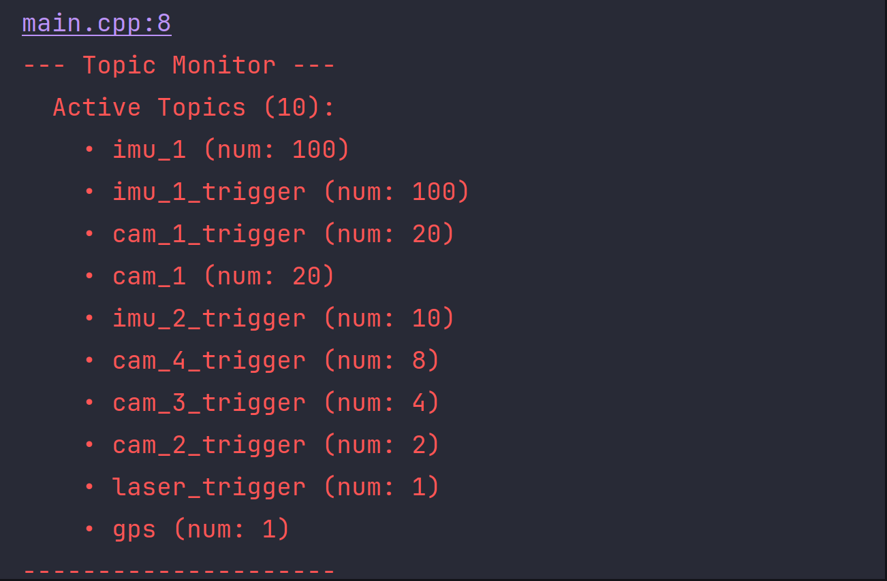

# 下载安装
```bash
sudo apt-get install libzmq3-dev # 安装ZeroMQ(可选)
git clone git@github.com:InfiniteSenseLab/InfiniteSenseSDK2.0.git -b main
cd InfiniteSenseSDK2.0
mkdir build && cd build
cmake..
```
# 编译运行
## 运行监听程序(可选)
运行话题监听程序,可以帮助检查是否有数据接收与数据上传频率是否正常，另外monitor也可显示SDK内部Topic的名称。
```bash
cd build/tools
./monitor
```
<p align="center">

</p>
其中，cam_1_trigger (num: 20) 表示图像触发信号，cam_1 (num: 20) 表示图像帧数据。num表示一秒内接收的图像帧数，即频率为20Hz。

## 运行example中的程序
### 运行工业相机Demo
```bash
cd build/examples/GigeCam
./gige_cam
```
## 运行工业相机ROS2节点
### 查看IMU数据
```bash
  sudo apt-get install ros-${ROS_DISTRO}-imu-tools
```

#

##  使用SDKC++开发的基本流程如下：
```C++
// 加入SDK头文件
#include "infinite_sense.h"
// 加入工业相机头文件
#include "mv_cam.h"
using namespace infinite_sense;
// 自定义回调函数
void ImuCallback(const void* msg, size_t) {
  const auto* imu_data = static_cast<const ImuData*>(msg);
  // 处理IMU数据
}
// 自定义回调函数
void ImageCallback(const void* msg, size_t) {
  const auto* cam_data = static_cast<const CamData*>(msg);
  // 处理图像数据
}
int main() {
  // 1.创建同步器
  Synchronizer synchronizer;
  synchronizer.SetUsbLink("/dev/ttyACM0", 921600);

  // 2.配置同步接口
  auto mv_cam = std::make_shared<MvCam>();
  mv_cam->SetParams({{"camera_1", CAM_1}});
  synchronizer.UseSensor(mv_cam);

  // 3.开启同步
  synchronizer.Start();

  // 4.接收数据
  Messenger::GetInstance().SubStruct("imu_1", ImuCallback);
  Messenger::GetInstance().SubStruct("camera_1", ImageCallback);
  // 阻塞线程
  while (true) {
    std::this_thread::sleep_for(std::chrono::milliseconds(100));
  }
  // 5.停止同步
  synchronizer.Stop();
  return 0;
}
```